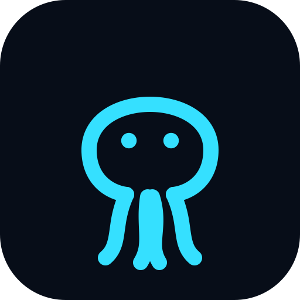

  

<h1 align="center">octopuscrawl</h1>

  Pretraining the first hacker-native LLM — from scratch, on nothing but what she reads.

  <a href="https://octopuscrawl.net"><b>octopuscrawl.net →</b></a>

---

A queen octopus crawls the public security web — OWASP, MITRE ATT&CK, CWE/CAPEC,
NVD advisories, PortSwigger, RFCs — and pretrains a language model on nothing but
what her tentacles read. The engine only **reads** published pages; it never
scans, attacks, or acts on anything it finds.

Everything is live and watchable: pages loading in real time, a knowledge graph
forming from the links she follows, a vocabulary growing as she reads, and a
model — trained from random initialization on the corpus — that slowly learns to
write.

Built entirely in **Rust**.

## What you can watch

- **The crawl, live** — a canvas octopus sits on each real page and inks the
  headings and text her tentacles reach, as the hatchlings read in chapters:
  advisories, patches, standards, writeups, tooling, RFCs.
- **Knowledge graph** — every page she reads becomes a node and every link she
  follows an edge; the map grows and branches in real time.
- **Forming vocabulary** — a BPE tokenizer she trains on the crawl itself; the
  security subwords she learns to recognise, surfacing as she reads.
- **The queen writes** — a small GPT pretrained from scratch on her corpus.
  Crude at first, sharper the more she reads. Every 250 new pages, the next
  version trains itself; the page count it saw is recorded when the run ends.
- **A crawl that does not run dry** — pages are discovered from every link on
  each page read, from CISA's Known Exploited Vulnerabilities catalog and from
  the sitemaps sites publish for crawlers. Reads rotate across sites (politely,
  never one host back-to-back), content pages first, steering toward whichever
  chapter is least covered so the dataset grows wide. The queue survives restarts.
- **Dataset stats** — pages, tokens, hosts and size, live. The corpus itself is
  the queen's alone and is not distributed.

## How it's built

A single Rust workspace carries the whole pipeline — from the crawl engine to the
model to the live frontend:

| Crate | Role |
|---|---|
| `core` | Shared data models and the `LiveMsg` WebSocket protocol that ties everything together. |
| `crawler` | Headless-Chromium engine: reads public pages, returns a screenshot and the on-page content boxes. |
| `ingest` | Deduplicates (one record per URL + SimHash near-copies), redacts e-mail addresses, tokenizes (BPE) and stores each page. |
| `queen` | A from-scratch GPT (candle) pretrained on the corpus — training and text generation. |
| `api` | Axum REST + WebSocket server; broadcasts live crawler, page and graph events. |
| `web` | Leptos (WASM) frontend: the live octopus-over-document view, knowledge graph and queen. |

The pipeline is **crawl → clean &amp; dedupe → tokenize → pretrain → generate**.
Links are followed within an allowlist of security hosts, so coverage grows in
finite, completable chapters; every 250 new pages the next queen is pretrained
from random init. The weights stay private — the source is here so anyone can
verify how she is made.

## Guardrails

The engine respects `robots.txt`, never bypasses a paywall or a bot check,
redacts e-mail addresses before the dataset, and only follows links inside an
allowlist of security hosts. It reads both offense
and defense knowledge — so the queen understands how a weakness works *and* how to
defend against it — but it only ever **reads and documents**. It never executes,
scans, or attacks anything.

## License

**All rights reserved — source-available, not open source.**

This repository is public so anyone can read the code and verify the project is
genuine. You may **view** it; you may **not** copy, reuse, run, modify, or
redistribute it without written permission. See [LICENSE](LICENSE).
